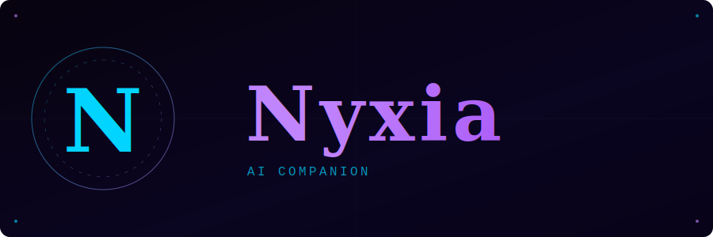

<p align="center">
  
</p>

An Electron-based desktop AI companion with a 3D avatar, local voice, persistent memory, and awareness of your system.

**End goal:** A fully local AI companion that integrates with your desktop and OS — always present, always aware, genuinely yours.

---

## Requirements

- **Node.js** v20+ (v24 recommended via nvm)
- **Python** 3.10+
- **Ollama** — [ollama.ai](https://ollama.ai) with the following models pulled:
  ```
  ollama pull llama3.2:3b
  ollama pull qwen3:8b
  ollama pull qwen2.5vl:7b
  ```
- **API key** — Anthropic (Claude) required. Others optional (ElevenLabs, Gemini, Groq, Mistral).

---

## Install

```bash
git clone https://github.com/Raiyzs/nyxia.git
cd nyxia
npm install
```

Install Python dependencies for the TTS servers:

```bash
pip install --user kokoro-onnx sounddevice numpy flask
```

---

## Run

```bash
./launch.sh
```

Or:

```bash
npm start
```

The launch script starts Ollama if it isn't running, then launches the app.

---

## API Keys

Set your keys inside the app under **Settings** (gear icon). No `.env` file needed — keys are stored locally in your user config directory and never touch the project folder.

---

## Features

- 3D animated avatar driven by emotion detection
- Local voice via Kokoro TTS (no internet required)
- Voice input via Whisper STT
- Persistent semantic memory (LanceDB + Kùzu graph)
- System awareness — clipboard, active windows, screen, files
- Agent loop with tool use (search, shell, browser, filesystem)
- Multi-provider support — Claude, Gemini, Groq, Mistral, Ollama
- PWA companion interface for phone
